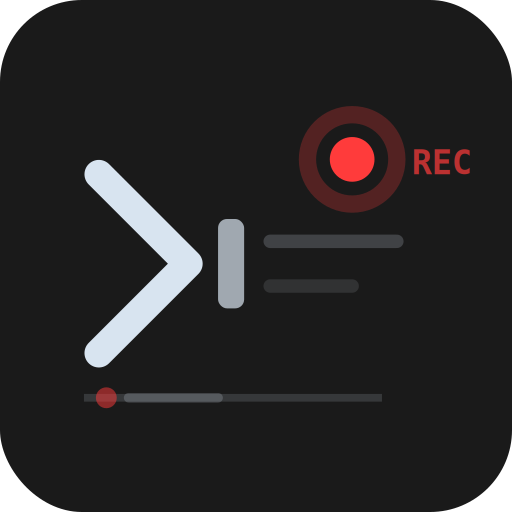
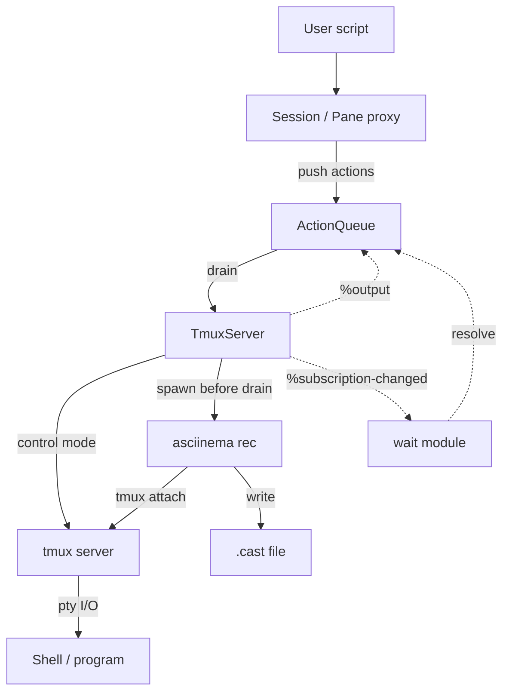

# term-recorder



Scriptable terminal recordings. Write TypeScript to drive tmux sessions and
produce [asciicast][asciicast] files you can play back with
[asciinema][asciinema] or embed on the web.

## Requirements

- [tmux][tmux-install] 3.4+ (session management)
- [asciinema][asciinema-install] 3.0+ (recording)
- Node.js 20+, Bun, or Deno (runtime)

## Install

```sh
npm install @letientai299/term-recorder
```

## Quick start

Create a script file (e.g. `demos.ts`):

```ts
import { defineConfig, main, record } from "@letientai299/term-recorder";

const config = defineConfig();

await main(config, [
  record("hello", (s) => {
    s.send("echo 'Hello from term-recorder!'");
    s.send("ls -la");
  }),
]);
```

Run it:

```sh
bun demos.ts        # Bun
npx tsx demos.ts    # Node.js
```

Output lands in `./casts/hello.cast` by default. Play it back:

```sh
asciinema play casts/hello.cast
```

## CLI flags

All flags are optional — defaults work for most cases. Pass `--help` to see the
full list:

```
USAGE bun demos.ts [OPTIONS]

OPTIONS

              -h, --help    Show this help message
              --headless    No visible terminal; auto-parallel at cpus/2
      -p, --parallel=<N>    Max concurrent recordings (default: 1, or cpus/2 if headless)
  -o, --output-dir=<DIR>    Output directory (default: ./casts)
    -f, --filter=<REGEX>    Run only recordings whose name matches this regex
              --cols=<N>    Terminal columns (default: 120)
              --rows=<N>    Terminal rows (default: 30)
        --load-tmux-conf    Use your tmux.conf instead of a clean config
               --dry-run    Print recording names and exit
   --trailing-delay=<MS>    Idle time before ending so the last frame stays visible (default: 1000)
             --pace=<MS>    Delay after each pane action (default: 1000, 0 to disable)
     --typing-delay=<MS>    Per-character delay for type() actions (default: 30)
     --action-delay=<MS>    Auto-pause inserted between queued actions (default: 200)
```

## API

The `record()` callback receives a `Session` (the main pane) and a
`RunnerConfig` with resolved settings. All methods are chainable and queue
actions — nothing executes until `main()` drains the queue. See the TSDoc on
each method for details.

The table below maps APIs to examples that demonstrate them:

| API                              | Examples                           |
| -------------------------------- | ---------------------------------- |
| `type`, `enter`, `key`           | [simple], [fzf], [interactive-tui] |
| `run`, `reply`                   | [interactive-tui], [render-test]   |
| `send`                           | [ruler], [fzf]                     |
| `splitH`, `splitV`               | [simple]                           |
| `waitForText`, `waitForIdle`     | [agents], [simple]                 |
| `detectPrompt`, `waitForPrompt`  | [ruler], [interactive-tui]         |
| `pace`, `sleep`                  | [render-test], [interactive-tui]   |
| `RunnerConfig` (second callback) | [ruler]                            |
| `defineConfig` (shell, env, cwd) | [ruler], [interactive-tui]         |

[simple]: examples/simple.ts
[fzf]: examples/fzf.ts
[interactive-tui]: examples/interactive-tui.ts
[render-test]: examples/render-test.ts
[agents]: examples/agents.ts
[ruler]: examples/ruler.ts

## How it works

The core idea is to combine two tools that each do one thing well:

- **tmux** provides a scriptable terminal multiplexer. It gives us a real pty
  that programs interact with normally — shell prompts, escape sequences, cursor
  movement, split panes — all work as they would in a real terminal. Its
  [control mode][tmux-cc] (`tmux -CC`) exposes a structured protocol over
  stdin/stdout: we send commands and receive push notifications (`%output`,
  `%subscription-changed`) without polling.
- **asciinema** records pty output into [asciicast][asciicast] files with
  accurate timing. It attaches to the tmux session via
  `asciinema rec -c 'tmux attach ...'`, capturing everything the terminal emits.

You write a TypeScript script that describes terminal actions (type text, press
keys, wait for output, split panes). The library queues those actions, then
drains them one by one against the tmux session while asciinema captures the
result.



### Key design choices

- **Queue-then-execute.** The script callback runs synchronously to build an
  action queue. Actual tmux I/O happens only when `drain()` is called. This
  keeps the scripting API simple and chainable.
- **Isolated tmux sockets.** Each recording gets its own tmux server via
  `tmux -L <unique-name>`, so parallel recordings and the user's tmux sessions
  never collide.
- **Control mode over subprocesses.** After `connect()`, all commands go through
  a persistent control mode connection instead of spawning individual `tmux`
  processes. This is faster and enables push-based `%output` notifications for
  efficient waiting.
- **Clean tmux by default.** `tmux -f /dev/null` prevents user config from
  affecting reproducibility. Pass `--load-tmux-conf` to use your own theme and
  status bar.
- **Headful vs headless.** Headful mode runs asciinema in the foreground
  terminal (sequential only). The tmux window is 1 smaller in each dimension so
  tmux draws a visible border within the cast frame. Headless mode uses
  `asciinema rec --headless`, auto-parallelizes to `cpus / 2`, and produces
  borderless output. Both modes produce casts at the configured dimensions, but
  usable area differs: `--cols 120 --rows 30` gives scripts 120×30 in headless
  and 119×29 in headful.

## Tips

### Clean shell prompt for demos

Your personal shell prompt (starship, oh-my-zsh, etc.) can leak personal info
and distract from the demo content. Use `shell` and `env` to start a bare zsh
with a minimal prompt:

```ts
const config = defineConfig({
  shell: "exec zsh --no-rcs",
  env: { PS1: "%F{cyan}%~%f\n$ " },
});
```

The two `zsh` invocations are intentional: the outer one runs `-c` to set `PS1`,
then `exec zsh --no-rcs` replaces it with an interactive shell that inherits the
variable.

- `%~` shows the full path from home, `%F{cyan}` adds color.
- `--no-rcs` skips all zsh startup files so nothing overrides the prompt.

### Session-level environment variables

Use `env` to set environment variables visible to all panes (including splits):

```ts
const config = defineConfig({
  env: { EDITOR: "vim", TERM: "xterm-256color" },
});
```

Variables set via `env` are applied at the tmux session level, so every pane
inherits them automatically. This is useful for controlling tool behavior
(`EDITOR`, `PAGER`), ensuring color support (`TERM`, `COLORTERM`), or hiding
personal details (`HOME`, `USER`).

### Converting casts to GIFs

The `.cast` format is great for playback with copyable text content. But, it's
not widely supported. Use [agg][agg] to convert to GIF for sharing:

```sh
agg casts/hello.cast casts/hello.gif
```

For SVG output, use [svg-term][svg-term] instead.

This project includes a [`scripts/cast-to-gif.ts`][cast2gif] script that
batch-converts all casts with [FiraCode Nerd Font][firacode-nf] and symbol
fallbacks — see [docs/contributing.md](docs/contributing.md) for the `mise gif`
task that wraps it.

[cast2gif]: ./scripts/cast-to-gif.ts

## Development

See [docs/contributing.md](docs/contributing.md).

## Limitations

- **External tool dependency.** Requires tmux 3.4+ and asciinema 3.0+ installed
  on the host. Contributors can use `mise install` to get both automatically.
- **No per-action error recovery.** If a wait action times out, the entire
  recording is aborted. There is no way to catch and retry individual actions.
- **Serialized tmux commands.** The control mode mutex means no two tmux
  commands run simultaneously, even across different panes. Multi-pane scripts
  are sequential at the I/O layer.

[agg]: https://github.com/asciinema/agg
[ffmpeg]: https://ffmpeg.org
[firacode-nf]: https://github.com/ryanoasis/nerd-fonts/releases
[asciicast]: https://docs.asciinema.org/manual/asciicast/v2/
[asciinema]: https://asciinema.org
[svg-term]: https://github.com/marionebl/svg-term-cli
[tmux]: https://github.com/tmux/tmux
[tmux-cc]: https://github.com/tmux/tmux/wiki/Control-Mode
[tmux-install]: https://github.com/tmux/tmux/wiki/Installing
[asciinema-install]: https://docs.asciinema.org/manual/cli/installation/
