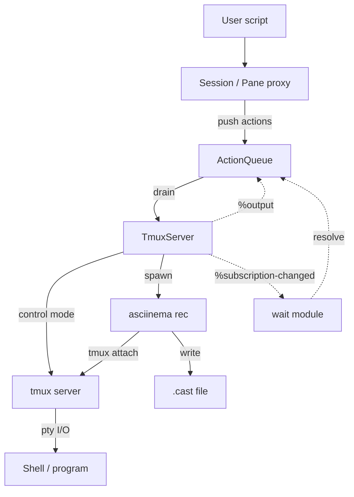

# term-recorder

Scriptable terminal recordings. Write TypeScript to drive tmux sessions and
produce [asciicast][asciicast] files you can play back with
[asciinema][asciinema] or embed on the web.

## Requirements

- [tmux][tmux-install] 3.4+ (session management)
- [asciinema][asciinema-install] 3.0+ (recording)
- Node.js 20+, Bun, or Deno (runtime)

## Install

```sh
npm install @letientai299/term-recorder
```

## Quick start

Create a script file (e.g. `demos.ts`):

```ts
import { defineConfig, main, record } from "@letientai299/term-recorder";

const config = defineConfig();

await main(config, [
  record("hello", (s) => {
    s.type("echo 'Hello from term-recorder!'").enter();
    s.type("ls -la").enter();
  }),
]);
```

Run it:

```sh
npx tsx demos.ts    # Node.js
bun demos.ts        # Bun
```

Output lands in `./casts/hello.cast` by default. Play it back:

```sh
asciinema play casts/hello.cast
```

## How it works

The core idea is to combine two tools that each do one thing well:

- **tmux** provides a scriptable terminal multiplexer. It gives us a real pty
  that programs interact with normally — shell prompts, escape sequences, cursor
  movement, split panes — all work as they would in a real terminal. Its
  [control mode][tmux-cc] (`tmux -CC`) exposes a structured protocol over
  stdin/stdout: we send commands and receive push notifications (`%output`,
  `%subscription-changed`) without polling.
- **asciinema** records pty output into [asciicast][asciicast] files with
  accurate timing. It attaches to the tmux session via
  `asciinema rec -c 'tmux attach ...'`, capturing everything the terminal emits.

You write a TypeScript script that describes terminal actions (type text, press
keys, wait for output, split panes). The library queues those actions, then
drains them one by one against the tmux session while asciinema captures the
result.



### Key design choices

- **Queue-then-execute.** The script callback runs synchronously to build an
  action queue. Actual tmux I/O happens only when `drain()` is called. This
  keeps the scripting API simple and chainable.
- **Isolated tmux sockets.** Each recording gets its own tmux server via
  `tmux -L <unique-name>`, so parallel recordings and the user's tmux sessions
  never collide.
- **Control mode over subprocesses.** After `connect()`, all commands go through
  a persistent control mode connection instead of spawning individual `tmux`
  processes. This is faster and enables push-based `%output` notifications for
  efficient waiting.
- **Clean tmux by default.** `tmux -f /dev/null` prevents user config from
  affecting reproducibility. Pass `--load-tmux-conf` to use your own theme and
  status bar.
- **Headful vs headless.** Headful mode runs asciinema in the foreground
  terminal (sequential only). The tmux window is 1 smaller in each dimension so
  tmux draws a visible border within the cast frame. Headless mode uses
  `asciinema rec --headless`, auto-parallelizes to `cpus / 2`, and produces
  borderless output. Both modes produce casts at the configured dimensions, but
  usable area differs: `--cols 120 --rows 30` gives scripts 120×30 in headless
  and 119×29 in headful.

## Tips

### Clean shell prompt for demos

Your personal shell prompt (starship, oh-my-zsh, etc.) can leak personal info
and distract from the demo content. Use `shell` and `env` to start a bare zsh
with a minimal prompt:

```ts
const config = defineConfig({
  shell: "zsh -c 'PS1=\"%F{cyan}%~%f $ \" exec zsh --no-rcs'",
});
```

`--no-rcs` skips all zsh startup files so nothing overrides the prompt. `%~`
shows the full path from home, `%F{cyan}` adds color. The two `zsh` invocations
are intentional: the outer one runs `-c` to set `PS1`, then `exec zsh --no-rcs`
replaces it with an interactive shell that inherits the variable.

### Session-level environment variables

Use `env` to set environment variables visible to all panes (including splits):

```ts
const config = defineConfig({
  env: { EDITOR: "vim", TERM: "xterm-256color" },
});
```

Variables set via `env` are applied at the tmux session level, so every pane
inherits them automatically. This is useful for controlling tool behavior
(`EDITOR`, `PAGER`), ensuring color support (`TERM`, `COLORTERM`), or hiding
personal details (`HOME`, `USER`).

## Development

[mise][mise] manages all dev tools. After cloning:

```sh
mise install      # installs bun, tmux, asciinema, agg, prek
bun install       # installs npm dependencies
prek install      # activates git hooks (lint, fmt, test on commit)
```

On Windows, use [WSL 2][wsl] — tmux has no native Windows port. Inside WSL the
setup is identical.

See `mise tasks` for available commands.

### Building

```sh
mise build        # compile TypeScript to dist/
```

Produces `.js`, `.d.ts`, `.d.ts.map`, and `.js.map` files in `dist/`.
`prepublishOnly` runs this automatically before `npm publish`.

### Recording

```sh
mise record        # headless, parallel — outputs to casts/*.cast
mise record:ui     # headful, sequential — same output, visible terminal
```

Both tasks track `src/**/*.ts` and `examples/**/*.ts` as inputs and
`casts/*.cast` as outputs. mise skips re-recording when sources haven't changed.
Use `mise run --force record` to bypass the check, or `mise clean` to wipe
`casts/` and `dist/` first.

### GIF generation

```sh
mise gif
```

Converts all `casts/*.cast` to `casts/*.gif`. On first run, it downloads
[FiraCode Nerd Font][firacode-nf] into `.fonts/` (cached for subsequent runs).

Like the record tasks, `mise gif` skips when outputs are newer than inputs.

### Other tasks

| Task            | Description                   |
| --------------- | ----------------------------- |
| `mise build`    | Compile TypeScript to `dist/` |
| `mise test`     | Unit tests                    |
| `mise e2e`      | End-to-end tests (needs tmux) |
| `mise test:all` | All tests                     |
| `mise lint`     | Type-check and lint           |
| `mise fmt`      | Format with Prettier          |
| `mise clean`    | Remove `casts/` and `dist/`   |

### Publishing

```sh
npm version patch   # or minor, major — commits and tags automatically
git push && git push --tags
npm publish --access public
```

`prepublishOnly` runs `mise build` before packing, so `dist/` is always fresh.

## Limitations

- **External tool dependency.** Requires tmux 3.4+ and asciinema 3.0+ on the
  host system. Contributors can use `mise install` to get both automatically.
- **asciicast only.** Outputs `.cast` files. Convert with [agg][agg],
  [svg-term][svg-term], or similar post-processing tools.
- **Headful mode is sequential.** Concurrency is locked to 1 because asciinema
  occupies the foreground terminal.
- **200-line scrollback capture.** `capturePane` fetches the last 200 lines.
  Text scrolled beyond that cannot be matched by `waitForText`.
- **No per-action error recovery.** A timeout or tmux error during `drain()`
  aborts the entire recording.
- **Serialized tmux commands.** The control mode mutex means no two tmux
  commands run simultaneously, even across different panes. Multi-pane scripts
  are sequential at the I/O layer.
- **`waitForIdle` silence window is fixed.** The 500 ms output-silence threshold
  is not configurable.
- **`shift-<letter>` unsupported.** The `shift` modifier only works with named
  keys (`shift-Tab`, `shift-F1`), not letters.
- **`cmd-`/`opt-` map to Meta.** macOS-specific modifiers are aliases for `alt`.
  The real macOS Command key cannot be sent through tmux.
- **`detectPrompt` trims trailing spaces.** Prompts ending with whitespace are
  stored trimmed, so `waitForPrompt()` matches the trimmed form.

[agg]: https://github.com/asciinema/agg
[firacode-nf]: https://github.com/ryanoasis/nerd-fonts/releases
[mise]: https://mise.jdx.dev
[asciicast]: https://docs.asciinema.org/manual/asciicast/v2/
[asciinema]: https://asciinema.org
[svg-term]: https://github.com/marionebl/svg-term-cli
[tmux]: https://github.com/tmux/tmux
[tmux-cc]: https://github.com/tmux/tmux/wiki/Control-Mode
[tmux-install]: https://github.com/tmux/tmux/wiki/Installing
[asciinema-install]: https://docs.asciinema.org/manual/cli/installation/
[wsl]: https://learn.microsoft.com/en-us/windows/wsl/install
