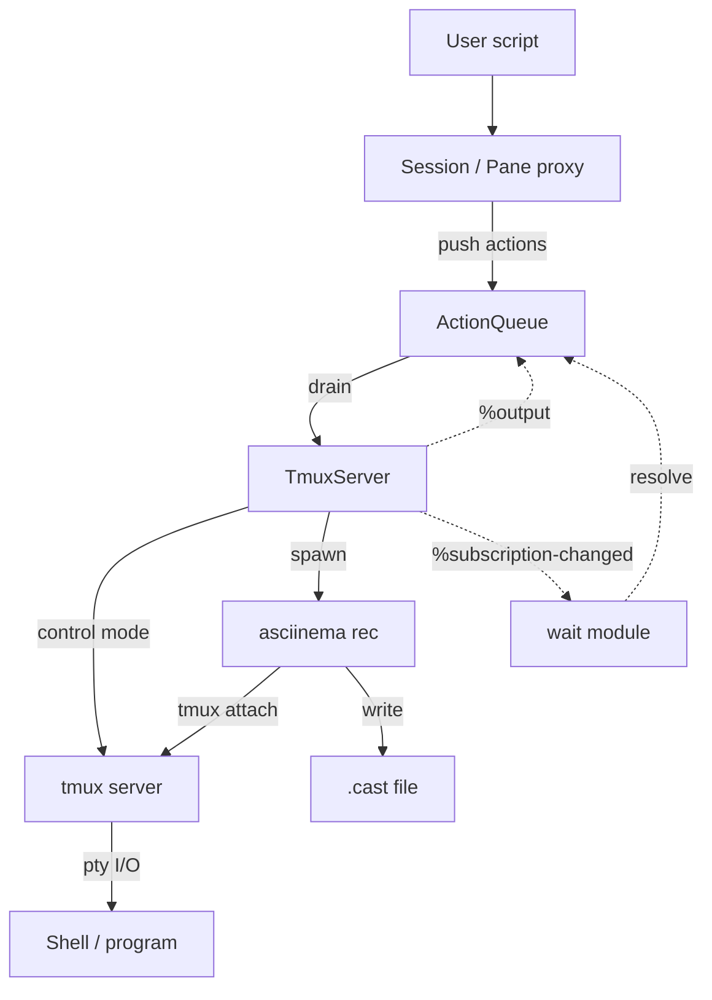

# term-recorder

Scriptable terminal recordings. Write TypeScript to drive tmux sessions and
produce [asciicast][asciicast] files you can play back with
[asciinema][asciinema] or embed on the web.

## Requirements

- [Bun][bun] (runtime)
- [tmux][tmux] 3.4+ (session management — uses control mode subscriptions and
  `capture-pane -T`)
- [asciinema][asciinema] 2.0+ (recording — uses `rec --overwrite`)

## Install

```sh
bun install
```

## Quick start

Create a script file (e.g. `demos.ts`):

```ts
import { defineConfig, main, record } from "./src/index.ts";

const config = defineConfig();

await main(config, [
  record("hello", (s) => {
    s.type("echo 'Hello from term-recorder!'").enter();
    s.type("ls -la").enter();
  }),
]);
```

Run it:

```sh
bun demos.ts
```

Output lands in `./casts/hello.cast` by default. Play it back:

```sh
asciinema play casts/hello.cast
```

## How it works

The core idea is to combine two tools that each do one thing well:

- **tmux** provides a scriptable terminal multiplexer. It gives us a real pty
  that programs interact with normally — shell prompts, escape sequences, cursor
  movement, split panes — all work as they would in a real terminal. Its
  [control mode][tmux-cc] (`tmux -CC`) exposes a structured protocol over
  stdin/stdout: we send commands and receive push notifications (`%output`,
  `%subscription-changed`) without polling.
- **asciinema** records pty output into [asciicast][asciicast] files with
  accurate timing. It attaches to the tmux session via
  `asciinema rec -c 'tmux attach ...'`, capturing everything the terminal emits.

You write a TypeScript script that describes terminal actions (type text, press
keys, wait for output, split panes). The library queues those actions, then
drains them one by one against the tmux session while asciinema captures the
result.



### Key design choices

- **Queue-then-execute.** The script callback runs synchronously to build an
  action queue. Actual tmux I/O happens only when `drain()` is called. This
  keeps the scripting API simple and chainable.
- **Isolated tmux sockets.** Each recording gets its own tmux server via
  `tmux -L <unique-name>`, so parallel recordings and the user's tmux sessions
  never collide.
- **Control mode over subprocesses.** After `connect()`, all commands go through
  a persistent control mode connection instead of spawning individual `tmux`
  processes. This is faster and enables push-based `%output` notifications for
  efficient waiting.
- **Clean environment by default.** `tmux -f /dev/null` and a temp
  `ASCIINEMA_CONFIG_HOME` prevent user config from affecting reproducibility.
- **Headful vs headless.** Headful mode runs asciinema in the foreground
  terminal (sequential only). Headless mode runs asciinema in a detached capture
  session and auto-parallelizes to `cpus / 2`.

## Limitations

- **External tool dependency.** Requires tmux 3.4+ and asciinema 2.0+ installed
  on the system. No bundled or fallback implementation.
- **asciicast only.** Outputs `.cast` files. No SVG, GIF, or MP4. Use
  post-processing tools like [agg][agg] or [svg-term][svg-term] for other
  formats.
- **Fixed terminal size.** Sessions start at 100×40. The dimensions are not
  configurable.
- **Headful mode is sequential.** Concurrency is locked to 1 because asciinema
  occupies the foreground terminal.
- **200-line scrollback capture.** `capturePane` fetches the last 200 lines.
  Text scrolled beyond that cannot be matched by `waitForText`.
- **No per-action error recovery.** A timeout or tmux error during `drain()`
  aborts the entire recording.
- **Serialized tmux commands.** The control mode mutex means no two tmux
  commands run simultaneously, even across different panes. Multi-pane scripts
  are sequential at the I/O layer.
- **`waitForIdle` silence window is fixed.** The 500 ms output-silence threshold
  is not configurable.
- **`shift-<letter>` unsupported.** The `shift` modifier only works with named
  keys (`shift-Tab`, `shift-F1`), not letters.
- **`cmd-`/`opt-` map to Meta.** macOS-specific modifiers are aliases for `alt`.
  The real macOS Command key cannot be sent through tmux.
- **`detectPrompt` trims trailing spaces.** Prompts ending with whitespace are
  stored trimmed, so `waitForPrompt()` matches the trimmed form.

[agg]: https://github.com/asciinema/agg
[asciicast]: https://docs.asciinema.org/manual/asciicast/v2/
[asciinema]: https://asciinema.org
[bun]: https://bun.sh
[svg-term]: https://github.com/marionebl/svg-term-cli
[tmux]: https://github.com/tmux/tmux
[tmux-cc]: https://github.com/tmux/tmux/wiki/Control-Mode
