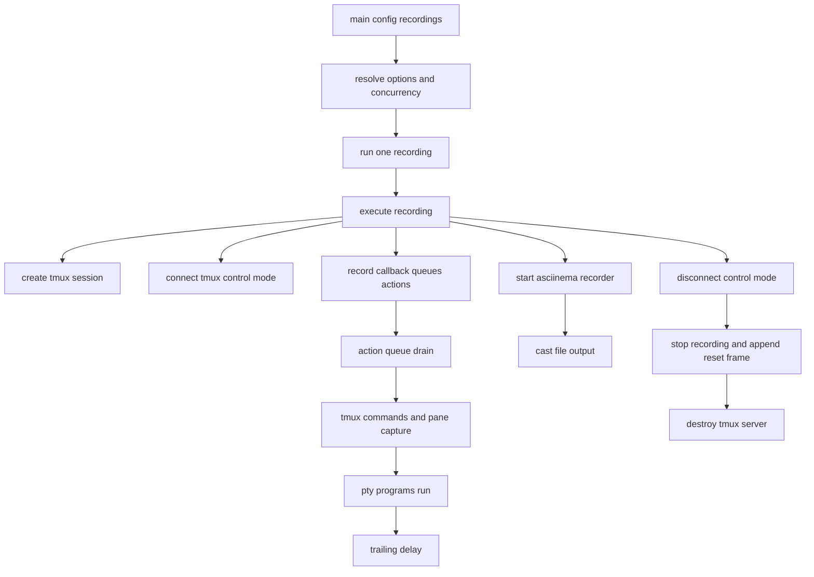
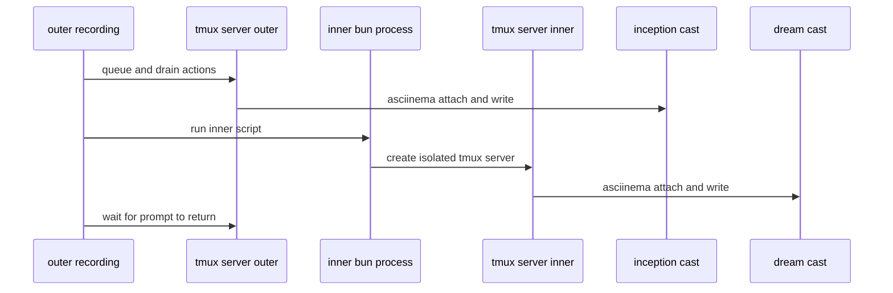

# Architecture

This document captures how `term-recorder` works today so we can redesign from
facts, not assumptions. The focus is runtime behavior and architectural
constraints, including nested recording (`examples/inception.ts`).

## Design goals

See [about.md][about] for target audience and high-level goals.

- Drive a **real PTY** via `tmux`, not a mocked terminal.
- Keep scripting API **declarative** (queue first, execute later).
- Record output as **asciicast v3** via `asciinema` CLI 3.x.
- Support headful and headless modes with the same script semantics.
- Isolate recordings so parallel runs and nested runs do not collide.

## Component map

| Component          | Files                                                               | Responsibility                                                                               |
| ------------------ | ------------------------------------------------------------------- | -------------------------------------------------------------------------------------------- |
| Public API         | `src/index.ts`, `src/config.ts`, `src/recording.ts`, `src/types.ts` | Typed script surface (`defineConfig`, `record`, `main`, `Session`/`Pane` actions).           |
| Orchestrator       | `src/main.ts`, `src/execute.ts`                                     | Resolve CLI+config, filter/parallelize recordings, run one recording lifecycle, cleanup.     |
| Action runtime     | `src/queue.ts`                                                      | Build and drain action queue, pacing, placeholder resolution for splits.                     |
| tmux control plane | `src/shell.ts`, `src/session.ts`, `src/pane.ts`                     | Isolated tmux server, control-mode dispatch, command serialization, pane/session operations. |
| Recording backend  | `src/recorder.ts`                                                   | Spawn/stop `asciinema`, ensure cast file is created, tty recovery on force-kill.             |
| Wait/readiness     | `src/wait.ts`                                                       | Polling + `%output` hinting, prompt/title/idle synchronization APIs.                         |

## End-to-end runtime flow

The script callback runs first and only **queues** actions. Real terminal I/O
starts when the queue drains.

## Lifecycle details

### 1) Descriptor and option resolution

- `record(name, script)` validates safe names (`[a-zA-Z0-9._\-/]+`, no `..`) in
  `src/recording.ts`.
- `main()` parses CLI flags in `src/main.ts`, merges them with `defineConfig()`
  values through `resolveOptions()`. Timing and size defaults (`typingDelay`,
  `actionDelay`, `pace`, `trailingDelay`, `cols`, `rows`) are applied later in
  `executeRecording()` (`src/execute.ts`).
- `main()` enforces unique recording names and optional regex filtering.

### 2) Session and control-mode bootstrap

- Each recording gets its own `TmuxServer` with a unique `-L` socket in
  `src/main.ts` and `src/execute.ts`.
- `createSession()` (`src/session.ts`) sets fixed window size, indexing, env,
  shell, and tmux options.
- `connect()` (`src/shell.ts`) attaches `tmux -C` and starts a long-lived
  dispatch loop.

### 3) Recording backend startup

- `startRecording()` (`src/recorder.ts`) spawns `asciinema rec` attached to that
  tmux session.
- Headful mode inherits stdio; headless mode uses `--headless` and ignored
  stdio.
- A cast file existence check gates startup (`waitForCastFile`), preventing
  queue execution before recorder readiness.

### 4) Queue build, then drain

- The record callback receives a `Session` proxy (`src/queue.ts`), which only
  pushes `Action` objects.
- `ActionQueue.drain()` executes actions serially, applying:
  - `typingDelay` (per-char for `type`),
  - `actionDelay` (between actions),
  - pane-level `pace` overrides.
- Split actions (`splitH`/`splitV`) return placeholder panes first, then replace
  placeholders with actual pane IDs once tmux returns `#{pane_id}`.

### 5) Wait/readiness model

- Wait APIs are implemented in `src/wait.ts` using `capture-pane` snapshots
  (last 200 lines) plus `%output` hint wakeups.
- `waitForText`/`waitForPrompt` are content-based polling.
- `waitForTitle` and part of `waitForIdle` use tmux subscription events
  (`refresh-client -B` + `%subscription-changed`).
- `waitForIdle` is two-phase: detect change, then detect output silence window.

### 6) Teardown and cast finalization

- `executeRecording()` disconnects control mode (`srv.disconnect()`) first.
- `stopRecording()` kills the tmux session, then lets `asciinema` exit (SIGTERM,
  SIGKILL fallback), with `stty sane` fallback specifically after SIGKILL.
- `executeRecording()` appends a final DECSTBM reset frame (`\x1b[r`) to avoid
  replay-side scroll-region artifacts.
- Headful mode emits terminal-reset escape sequences (exit alternate screen,
  reset scroll region, show cursor, reset SGR, disable mouse/bracketed-paste/
  focus events, normal keypad) to restore host terminal state.

## tmux control-mode internals

`TmuxServer` is the architectural center of the runtime:

- **Command path**: all tmux commands are serialized by a mutex (`commandLock`)
  and mapped to `%begin/%end` blocks.
- **Event path**: dispatch loop parses `%output` and `%subscription-changed`.
- **Wait integration**: wait APIs subscribe/unsubscribe listeners around
  operations.

This gives a single ordered control plane. It simplifies correctness, but it
also means tmux command execution is globally serialized even when panes are
independent.

## Action model and semantics

`ActionDefs` in `src/types.ts` is the source of truth for queue actions:

- Input actions: `send`, `type`, `key`, `enter`.
- Timing actions: `sleep`, `pace`.
- Synchronization actions: `waitForText`, `waitForPrompt`, `detectPrompt`,
  `waitForTitle`, `waitForIdle`.
- Topology actions: `splitH`, `splitV`.

The `Pane`/`Session` proxies in `src/queue.ts` add convenience methods that push
multiple actions:

- `run` pushes `type` + `enter`.
- `reply` pushes `type` + `enter` + `waitForPrompt`.
- No per-action recovery. A timed-out wait aborts the recording.
- Queue is not "live"; script code and terminal execution are decoupled phases.

## Nested recording (`examples/inception.ts`)

`inception.ts` runs a recorder script that dynamically writes another recorder
script (`dream.ts`) and executes it with `bun`.

### Why nested works today

- **Socket isolation**: each `main()` call uses its own tmux socket.
- **Process boundary**: inner recorder is a normal subprocess from outer shell's
  perspective.
- **Name isolation**: cast path derived from each recording name.

### Architectural weaknesses exposed by nested usage

- **No cross-recorder coordination**: outer script cannot observe inner status
  except terminal text heuristics.
- **Prompt-coupled synchronization**: `waitForText("inception $")` depends on a
  specific prompt string and shell behavior.
- **Lifecycle orphan risk**: if outer process dies mid-run, inner recorder may
  continue until its own cleanup path triggers.
- **Global command serialization per recorder**: internal pane concurrency is
  constrained by one tmux command channel.
- **Polling visibility window**: `capture-pane -S -200` can miss transient
  output outside the captured window.

These are exactly the seams to protect (or intentionally redesign) if nested
recording must remain a first-class capability.

## Architectural invariants to preserve in redesign

- One recorder instance must own one isolated tmux server/socket.
- Recording must run against real PTY behavior (escape codes, shell prompts,
  full-screen TUIs).
- Script API must remain deterministic under headful and headless modes.
- Teardown must restore terminal state even on abnormal termination.
- Nested recorder execution must not corrupt parent or sibling sessions.

## Redesign pressure points

These are the practical pressure points visible from current architecture:

1. **Synchronization abstraction**: move from ad-hoc `waitFor*` calls toward a
   smaller, explicit readiness model.
2. **Queue/runtime coupling**: consider a model that can stay semantically
   synchronous with runtime state while keeping deterministic recordings.
3. **Nested lifecycle contracts**: define explicit parent/child recorder
   contracts (status, cancellation, completion) instead of prompt matching.
4. **Wait engine reliability**: reduce dependence on snapshot polling windows.

---

Related references:

- [README "How it works"][readme-how]
- [Terminal Program Taxonomy][taxonomy]
- [Readiness Detection][readiness]
- [examples/inception.ts][inception]

[about]: ./about.md
[readme-how]: ../README.md#how-it-works
[taxonomy]: ./terminal-programs.md
[readiness]: ./readiness-detection.md
[inception]: ../examples/inception.ts
